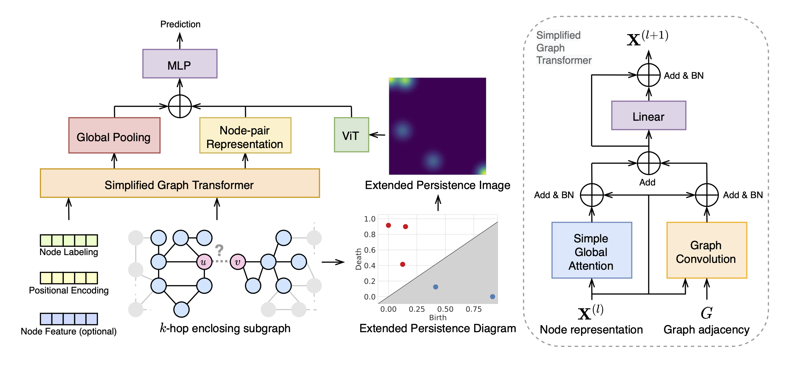
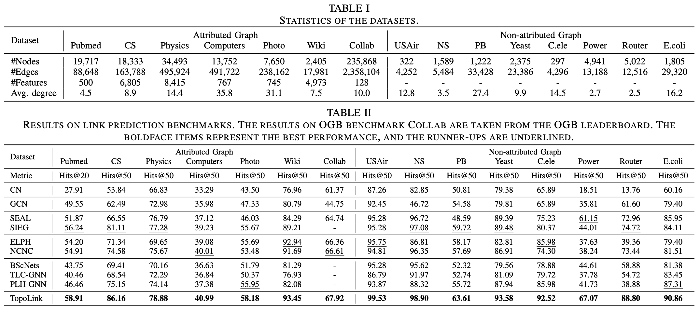

# TopoLink

This is the PyTorch implementation of **TopoLink: Topology-enhanced Graph Transformer with Extended Persistent Homology For Link Prediction**.



## Requirements

- Environment:
  - Python == 3.10
  - Nvidia RTX 4090 with CUDA 12.1
- Package dependencies:
  - PyTorch == 2.1.0
  - PyTorch Geometric == 2.4.0
  - GUDHI == 3.10.1
  - GraphRicciCurvature == 0.5.3.2
  - ogb == 1.3.6
  - einops == 0.8.0

## How to run

The commands and hyperparameter settings are provided in the `run.sh` script. The datasets will be automatically downloaded from the internet during program execution. Make sure the folder `data` exists in the root directory.

```shell
# Pubmed
python main.py --dataset_name Pubmed --val_pct 0.05 --test_pct 0.1 --eval_metric hits --lr 0.00005 --batch_size 32 --hidden_channels 128 --out_mlp_dim 256 --num_seal_layers 2 --mlp_dropout 0.5 --num_hops 2 --use_feature 1 --use_ph 1 --vit_dim 64 --vit_out_dim 128 --vit_depth 4 --vit_headers 4 --vit_mlp_dim 128 --extend 1 --use_pe True --walk_length 32 --dynamic_train

# CS
python main.py --dataset_name CS --val_pct 0.05 --test_pct 0.1 --eval_metric hits --lr 0.00005 --batch_size 32 --hidden_channels 128 --out_mlp_dim 256 --num_seal_layers 2 --mlp_dropout 0.5 --num_hops 2 --use_feature 1 --use_ph 1 --vit_dim 64 --vit_out_dim 128 --vit_depth 4 --vit_headers 4 --vit_mlp_dim 128 --extend 1 --use_pe True --walk_length 32 --dynamic_train --dynamic_val --dynamic_test

# Physics
python main.py --dataset_name Physics --val_pct 0.05 --test_pct 0.1 --eval_metric hits --lr 0.00005 --batch_size 32 --hidden_channels 128 --out_mlp_dim 256 --num_seal_layers 2 --mlp_dropout 0.5 --num_hops 2 --max_nodes_per_hop 20 --use_feature 1 --use_ph 1 --vit_dim 64 --vit_out_dim 128 --vit_depth 4 --vit_headers 4 --vit_mlp_dim 128 --extend 1 --use_pe True --walk_length 32 --dynamic_train --dynamic_val --dynamic_test --train_samples 0.2

# Computers
python main.py --dataset_name Computers --val_pct 0.05 --test_pct 0.1 --eval_metric hits --lr 0.00005 --batch_size 32 --hidden_channels 128 --out_mlp_dim 256 --num_seal_layers 2 --mlp_dropout 0.5 --num_hops 2 --max_nodes_per_hop 20 --use_feature 1 --use_ph 1 --vit_dim 64 --vit_out_dim 128 --vit_depth 4 --vit_headers 4 --vit_mlp_dim 128 --extend 1 --use_pe True --walk_length 32 --dynamic_train --dynamic_val --dynamic_test --train_samples 0.4

# Photo
python main.py --dataset_name Photo --val_pct 0.05 --test_pct 0.1 --eval_metric hits --lr 0.00005 --batch_size 32 --hidden_channels 128 --out_mlp_dim 256 --num_seal_layers 2 --mlp_dropout 0.5 --num_hops 2 --max_nodes_per_hop 20 --use_feature 1 --use_ph 1 --vit_dim 64 --vit_out_dim 128 --vit_depth 4 --vit_headers 4 --vit_mlp_dim 128 --extend 1 --use_pe True --walk_length 32 --dynamic_train --dynamic_val --dynamic_test

# Wiki
python main.py --dataset_name Wiki --val_pct 0.05 --test_pct 0.1 --eval_metric hits --lr 0.00005 --batch_size 32 --hidden_channels 128 --out_mlp_dim 256 --num_seal_layers 2 --mlp_dropout 0.5 --num_hops 2 --use_feature 1 --use_ph 1 --vit_dim 64 --vit_out_dim 128 --vit_depth 4 --vit_headers 4 --vit_mlp_dim 128 --extend 1 --use_pe True --walk_length 32 --dynamic_train --dynamic_val --dynamic_test

# -----------------------------------------------------------------------------

# USAir
python main.py --dataset_name USAir --val_pct 0.05 --test_pct 0.1 --eval_metric hits --lr 0.00005 --batch_size 32 --hidden_channels 128 --out_mlp_dim 256 --num_seal_layers 2 --mlp_dropout 0.5 --num_hops 2 --use_feature 0 --use_ph 1 --vit_dim 64 --vit_out_dim 128 --vit_depth 4 --vit_headers 4 --vit_mlp_dim 128 --extend 1 --use_pe True --walk_length 32

# NS
python main.py --dataset_name NS --val_pct 0.05 --test_pct 0.1 --eval_metric hits --lr 0.00005 --batch_size 32 --hidden_channels 128 --out_mlp_dim 256 --num_seal_layers 2 --mlp_dropout 0.5 --num_hops 2 --use_feature 0 --use_ph 1 --vit_dim 64 --vit_out_dim 128 --vit_depth 4 --vit_headers 4 --vit_mlp_dim 128 --extend 1 --use_pe True --walk_length 32

# PB
python main.py --dataset_name PB --val_pct 0.05 --test_pct 0.1 --eval_metric hits --lr 0.00005 --batch_size 32 --hidden_channels 128 --out_mlp_dim 256 --num_seal_layers 2 --mlp_dropout 0.5 --num_hops 2 --max_nodes_per_hop 50 --use_feature 0 --use_ph 1 --vit_dim 64 --vit_out_dim 128 --vit_depth 4 --vit_headers 4 --vit_mlp_dim 128 --extend 1 --use_pe True --walk_length 32 --dynamic_train --dynamic_val --dynamic_test

# Yeast
python main.py --dataset_name Yeast --val_pct 0.05 --test_pct 0.1 --eval_metric hits --lr 0.00005 --batch_size 32 --hidden_channels 128 --out_mlp_dim 256 --num_seal_layers 2 --mlp_dropout 0.5 --num_hops 2 --use_feature 0 --use_ph 1 --vit_dim 64 --vit_out_dim 128 --vit_depth 4 --vit_headers 4 --vit_mlp_dim 128 --extend 1 --use_pe True --walk_length 32 --dynamic_train --dynamic_val --dynamic_test

# Celegans
python main.py --dataset_name Celegans --val_pct 0.05 --test_pct 0.1 --eval_metric hits --lr 0.00005 --batch_size 32 --hidden_channels 128 --out_mlp_dim 256 --num_seal_layers 2 --mlp_dropout 0.5 --num_hops 2 --use_feature 0 --use_ph 1 --vit_dim 64 --vit_out_dim 128 --vit_depth 4 --vit_headers 4 --vit_mlp_dim 128 --extend 1 --use_pe True --walk_length 32

# Power
python main.py --dataset_name Power --val_pct 0.05 --test_pct 0.1 --eval_metric hits --lr 0.00005 --batch_size 32 --hidden_channels 128 --out_mlp_dim 256 --num_seal_layers 2 --mlp_dropout 0.5 --num_hops 2 --use_feature 0 --use_ph 1 --vit_dim 64 --vit_out_dim 128 --vit_depth 4 --vit_headers 4 --vit_mlp_dim 128 --extend 1 --use_pe True --walk_length 32 --dynamic_train --dynamic_val --dynamic_test

# Router
python main.py --dataset_name Router --val_pct 0.05 --test_pct 0.1 --eval_metric hits --lr 0.00005 --batch_size 32 --hidden_channels 128 --out_mlp_dim 256 --num_seal_layers 2 --mlp_dropout 0.5 --num_hops 2 --use_feature 0 --use_ph 1 --vit_dim 64 --vit_out_dim 128 --vit_depth 4 --vit_headers 4 --vit_mlp_dim 128 --extend 1 --use_pe True --walk_length 32 --dynamic_train --dynamic_val --dynamic_test

# Ecoli
python main.py --dataset_name Ecoli --val_pct 0.05 --test_pct 0.1 --eval_metric hits --lr 0.00005 --batch_size 32 --hidden_channels 128 --out_mlp_dim 256 --num_seal_layers 2 --mlp_dropout 0.5 --num_hops 2 --max_nodes_per_hop 50 --use_feature 0 --use_ph 1 --vit_dim 64 --vit_out_dim 128 --vit_depth 4 --vit_headers 4 --vit_mlp_dim 128 --extend 1 --use_pe True --walk_length 32 --dynamic_train --dynamic_val --dynamic_test

# -----------------------------------------------------------------------------

# COLLAB
python main.py --dataset_name ogbl-collab --year 2007 --num_workers 16 --lr 0.00005 --batch_size 32 --hidden_channels 64 --out_mlp_dim 128 --num_seal_layers 2 --mlp_dropout 0.5 --num_hops 1 --use_feature 1 --use_ph 1 --pi_dim 25 --vit_dim 32 --vit_out_dim 64 --vit_depth 4 --vit_headers 4 --vit_mlp_dim 64 --extend 1 --use_pe True --walk_length 32 --epochs 20 --dynamic_train --dynamic_val --dynamic_test --train_samples 0.15
```

## Results

